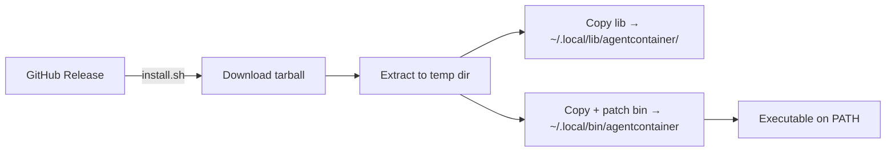

## Context

Agentcontainer is a pure Bash CLI tool (v0.1.0) distributed via GitHub releases and a curl-based installer. It has no server-side component, no external service dependencies, and no cloud infrastructure. CI runs on GitHub Actions with a 4-job matrix strategy covering lint, Linux integration tests, optional macOS integration tests, and Windows lint-only.

## Objectives

- `OBJ-cross-platform-ci`: Validate the CLI on all supported platforms and container runtimes before merge
- `OBJ-multi-runtime-coverage`: Test against every supported container runtime (Docker, Podman, nerdctl on Linux; Lima and Apple Container on macOS) across multiple architectures
- `OBJ-simple-distribution`: Enable single-command installation from GitHub releases with no build step required

## Deployment

Agentcontainer is a client-side CLI tool with no server deployment. Distribution uses a curl-pipe-to-bash installer.

**Installer behavior** (`install.sh`, 222 lines):
- Detects OS (Darwin/Linux) and architecture (x86_64/arm64) to select the correct release asset
- Accepts version via `AGENTCONTAINER_VERSION` env var or `--version` flag; defaults to "latest"
- Falls back to `main` branch archive if no release tarball exists
- Default install path: `~/.local/bin` (customizable via `AGENTCONTAINER_INSTALL_DIR` or `--dir`)
- Patches the main script's `LIB_DIR` to point to the installed library location
- Warns if install directory is not on `PATH`

**Manual install:** Clone the repo and symlink `bin/agentcontainer` to a directory on PATH.

**No release automation exists yet** — releases are created manually on GitHub.

## Testing Strategy

Testing is integration-based. The project validates the full command lifecycle (`init → build → up → shell → stop → down`) against real container runtimes. There is no unit test framework.

### Test environments

| Platform | Runner | Runtimes Tested | Architecture |
|----------|--------|-----------------|--------------|
| Linux | `ubuntu-latest` | Docker, Podman, nerdctl | amd64 |
| Linux | `ubuntu-24.04-arm` | Docker, Podman, nerdctl | arm64 |
| macOS | `self-hosted, macOS, ARM64` | Lima (VZ), Apple Container | arm64 |
| Windows | `windows-latest` | None (lint only) | amd64 |

**Total: 6 Linux runtime×arch combinations + 2 macOS runtimes + lint-only Windows.**

macOS tests are gated behind the `MACOS_RUNNER` repository variable and require a self-hosted Apple Silicon runner (Virtualization.framework is unavailable on GitHub-hosted runners).

### Test execution model

Each test phase runs as a separate GitHub Actions step because `shell.sh` uses `exec` (which replaces the process). Steps:
1. `agentcontainer init` — scaffold project config
2. `agentcontainer build` — build container image
3. `agentcontainer up` — start container
4. `agentcontainer shell` — run a test command inside the container
5. `agentcontainer stop` — stop the container
6. `agentcontainer down` — remove the container

Tests create an isolated `/tmp/ci-test-project` directory for each run.

### Lint and static analysis

- **ShellCheck** — lint all `.sh` files
- **`bash -n`** — syntax validation on all scripts
- Runs on every platform (Linux, macOS, Windows)

### Runtime-specific setup in CI

- **nerdctl:** Installs from nerdctl-full tarball, manages containerd daemon, starts buildkitd with containerd worker
- **Podman:** Installed via apt, configured for rootless mode with cgroupfs + file logger
- **Lima:** Installed via Homebrew, waits for VM startup
- **Apple Container:** Checks builder daemon availability; skips tests gracefully if unavailable

### Requirements coverage

| Capability | Test Coverage |
|-----------|--------------|
| `developer-initializes-project` | CI init step |
| `developer-builds-container` | CI build step |
| `developer-starts-container` | CI up step |
| `developer-runs-agent` | Not directly tested in CI |
| `developer-opens-shell` | CI shell step |
| `developer-stops-container` | CI stop step + down step |
| `developer-views-status` | Not tested in CI |
| `runtime-detects-platform` | macOS unit test for `detect_platform()` |
| `agent-auth-persists` | Not tested in CI |

### Coverage gaps

- No unit tests for config parsing, template expansion, or argument handling
- `developer-runs-agent` not tested (requires a real agent binary in the container)
- `developer-views-status` not tested
- `agent-auth-persists` not tested (requires multi-session lifecycle)
- `runtime-detects-platform` only has a macOS unit test; Linux/WSL detection untested at unit level

### CI/CD integration

- **Trigger:** Push and PR to `main`
- **Concurrency:** `cancel-in-progress: true` per ref to avoid redundant runs
- **Failure debugging:** Build failures dump buildkitd and containerd logs from systemd journal
- **Pipeline file:** `.github/workflows/ci.yml` (443 lines)
- **Documentation:** `CICD.md`

## Observability

Agentcontainer is a local CLI tool with no production telemetry. Observability is limited to user-facing output and debug facilities.

**CLI logging:**
- Color-coded log levels: `[info]` (blue), `[ok]` (green), `[warn]` (yellow), `[error]` (red)
- Colors disabled automatically in non-TTY environments
- Warnings go to stderr; info/ok go to stdout

**Debug mode:**
- `--debug` flag enables `set -x` for full bash trace output
- Applied globally across all sourced command modules

**Runtime introspection:**
- `agentcontainer status` prints detected platform, runtime, container command, availability status, and project configuration

**CI failure diagnostics:**
- nerdctl failures trigger dumps of buildkitd log (`/tmp/buildkitd.log`) and systemd journals for buildkit and containerd services

**Not present:**
- No metrics collection or dashboards
- No alerting or monitoring
- No structured logging (all output is human-readable text)
- No crash reporting or usage analytics
