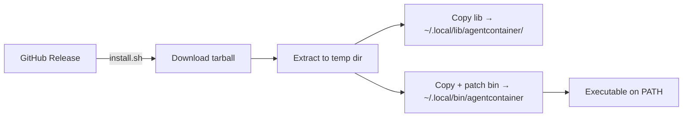

## Context

Agentcontainer is a pure Bash CLI tool (v0.1.0) distributed via GitHub releases and a curl-based installer. It has no server-side component, no external service dependencies, and no cloud infrastructure. CI runs on GitHub Actions with a 4-job matrix strategy covering lint, Linux integration tests, optional macOS integration tests, and Windows lint-only.

## Objectives

- `OBJ-cross-platform-ci`: Validate the CLI on all supported platforms and container runtimes before merge
- `OBJ-multi-runtime-coverage`: Test against every supported container runtime (Docker, Podman, nerdctl on Linux; Lima and Apple Container on macOS) across multiple architectures
- `OBJ-simple-distribution`: Enable single-command installation from GitHub releases with no build step required

## Deployment

Agentcontainer is a client-side CLI tool with no server deployment. Distribution uses a curl-pipe-to-bash installer.



**Installer behavior** (`install.sh`):
- Detects OS (Darwin/Linux) and architecture (x86_64/arm64) to select the correct release asset
- Accepts version via `AGENTCONTAINER_VERSION` env var or `--version` flag; defaults to "latest"
- Falls back to `main` branch archive if no release tarball exists
- Default install path: `~/.local/bin` (customizable via `AGENTCONTAINER_INSTALL_DIR` or `--dir`)
- Patches the main script's `LIB_DIR` to point to the installed library location
- Warns if install directory is not on `PATH`

**Manual install:** Clone the repo and symlink `bin/agentcontainer` to a directory on PATH.

**No release automation exists yet** — releases are created manually on GitHub.

## Testing Strategy

Testing is integration-based. The project validates the full command lifecycle against real container runtimes. There is no dedicated unit test framework; where unit-level validation exists (e.g., platform detection), it uses ad-hoc inline assertions within CI workflow steps rather than a test harness.

### Test environments

| Platform | Runner | Runtimes Tested | Architecture |
|----------|--------|-----------------|--------------|
| Linux | `ubuntu-latest` | Docker, Podman, nerdctl | amd64 |
| Linux | `ubuntu-24.04-arm` | Docker, Podman, nerdctl | arm64 |
| macOS | `self-hosted, macOS, ARM64` | Lima (VZ), Apple Container | arm64 |
| Windows | `windows-latest` | None (lint only) | amd64 |

**Total: 6 Linux runtime×arch combinations + 2 macOS runtimes + lint-only Windows.**

macOS tests are gated behind the `MACOS_RUNNER` repository variable and require a self-hosted Apple Silicon runner (Virtualization.framework is unavailable on GitHub-hosted runners).

### Test execution model

Each test phase runs as a separate GitHub Actions step because `shell.sh` uses `exec` (which replaces the process). Steps:
1. `agentcontainer init` — scaffold project config
2. `agentcontainer status` — verify status reports uninitialized/no-container state
3. `agentcontainer build` — build container image
4. `agentcontainer up` — start container
5. `agentcontainer status` — verify status reports initialized/running state
6. `agentcontainer shell` — run a test command inside the container
7. `agentcontainer stop` — stop the container
8. `agentcontainer down` — remove the container

Tests create an isolated `/tmp/ci-test-project` directory for each run.

### Lint and static analysis

- **ShellCheck** — lint all `.sh` files
- **`bash -n`** — syntax validation on all scripts

Per-platform lint coverage:

| Platform | Lint Execution | Conditional? |
|----------|---------------|--------------|
| Linux | Dedicated `lint` job | Unconditional — runs on every push/PR |
| Windows | Dedicated `test-windows` job | Unconditional — runs on every push/PR |
| macOS | Embedded in `test-macos` job | Conditional — gated by `MACOS_RUNNER` repository variable. When `MACOS_RUNNER` is not set, macOS lint does not execute. |

The macOS lint step includes a dual-Bash syntax check: `bash -n` runs against both the system Bash 3.2 (`/bin/bash`) and Homebrew Bash 5.x. The Bash 3.2 check serves as the compatibility gate preventing Bash 4+ syntax from entering the codebase, maintaining the Bash 3.1+ compatibility requirement documented in the technical spec.

### Runtime-specific setup in CI

- **nerdctl:** Installs from nerdctl-full tarball, manages containerd daemon, starts buildkitd with containerd worker
- **Podman:** Installed via apt, configured for rootless mode with cgroupfs + file logger
- **Lima:** Installed via Homebrew, waits for VM startup
- **Apple Container:** Checks builder daemon availability; skips tests gracefully if unavailable

### Requirements coverage

| Capability | Test Coverage |
|-----------|--------------|
| `developer-initializes-project` | CI init step |
| `developer-builds-container` | CI build step |
| `developer-starts-container` | CI up step |
| `developer-runs-agent` | Not directly tested in CI |
| `developer-opens-shell` | CI shell step |
| `developer-stops-container` | CI stop step + down step |
| `developer-views-status` | CI lifecycle steps (after init and after up) |
| `runtime-detects-platform` | Ad-hoc inline assertion in macOS CI job (`ci.yml`, `test-macos` job) |
| `agent-auth-persists` | Not tested in CI |

### Coverage gaps

- No unit tests for config parsing, template expansion, or argument handling
- `developer-runs-agent` not tested (requires a real agent binary in the container)
- `agent-auth-persists` not tested (requires multi-session lifecycle)
- `runtime-detects-platform` Linux/WSL detection untested at unit level. WSL detection is testable via mock: `detect_platform()` uses `grep` on `/proc/version`, which can be unit-tested by providing a mock version file containing `microsoft`. Making the version file path injectable would enable testing on plain Linux CI runners without requiring a WSL environment.

### Verification commands

**Local verification** (single runtime, requires test prerequisites installed):

```bash
# Lint
shellcheck lib/*.sh bin/agentcontainer install.sh
bash -n lib/*.sh bin/agentcontainer install.sh

# Integration lifecycle
dir=$(mktemp -d)
cd "$dir"
agentcontainer init
agentcontainer status
agentcontainer build
agentcontainer up
agentcontainer status
agentcontainer shell -- echo "smoke test"
agentcontainer stop
agentcontainer down
rm -rf "$dir"
```

Local runs cover a single container runtime on the host platform. Full matrix coverage requires CI.

**CI invocation:**
- Pushing to `main` or opening a PR triggers the full matrix automatically
- Manual dispatch: `gh workflow run ci.yml` (requires GitHub CLI)

### Test prerequisites

**Integration tests** require:
- A supported container runtime (Docker, Podman, nerdctl, Lima, or Apple Container)
- **devcontainer CLI** (`npm install -g @devcontainers/cli`) — the underlying engine that agentcontainer wraps; an architectural dependency, not merely a test utility
- **jq** — JSON processing for config manipulation
- **envsubst** (from `gettext`) — template variable expansion

**Lint** requires:
- **ShellCheck** — static analysis for shell scripts
- **Bash** — `bash -n` for syntax validation (macOS jobs require both system Bash 3.2 and Homebrew Bash 5.x)

CI workflows install these dependencies automatically. Local reproduction requires manual installation.

### CI/CD integration

- **Trigger:** Push and PR to `main`
- **Concurrency:** `cancel-in-progress: true` per ref to avoid redundant runs
- **Failure debugging:** Build failures dump buildkitd and containerd logs from systemd journal
- **Pipeline file:** `.github/workflows/ci.yml` (443 lines)
- **Documentation:** `CICD.md`

## Observability

Agentcontainer is a local CLI tool with no production telemetry. Observability is limited to user-facing output and debug facilities.

**CLI logging:**
- Color-coded log levels: `[info]` (blue), `[ok]` (green), `[warn]` (yellow), `[error]` (red)
- Colors disabled automatically in non-TTY environments
- Warnings go to stderr; info/ok go to stdout

**Debug mode:**
- `--debug` flag enables `set -x` for full bash trace output
- Applied globally across all sourced command modules

**Runtime introspection:**
- `agentcontainer status` prints detected platform, runtime, container command, availability status, and project configuration

**CI failure diagnostics:**
- nerdctl failures trigger dumps of buildkitd log (`/tmp/buildkitd.log`) and systemd journals for buildkit and containerd services

**Not present:**
- No metrics collection or dashboards
- No alerting or monitoring
- No structured logging (all output is human-readable text)
- No crash reporting or usage analytics
