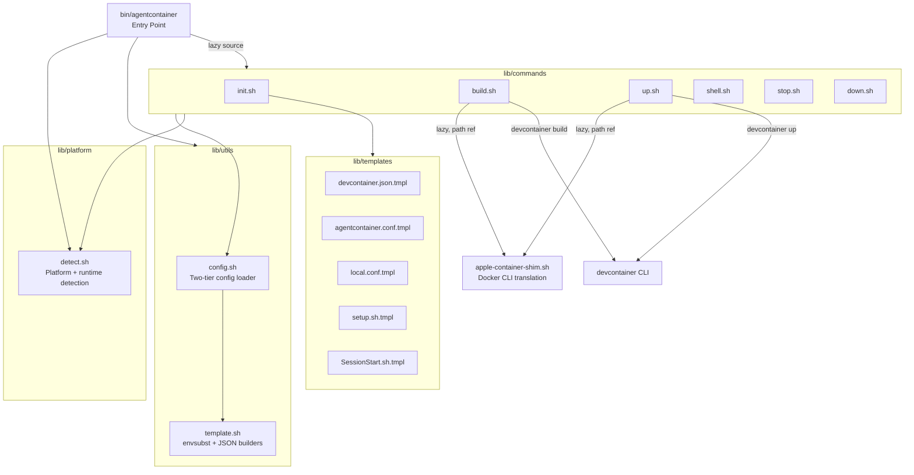
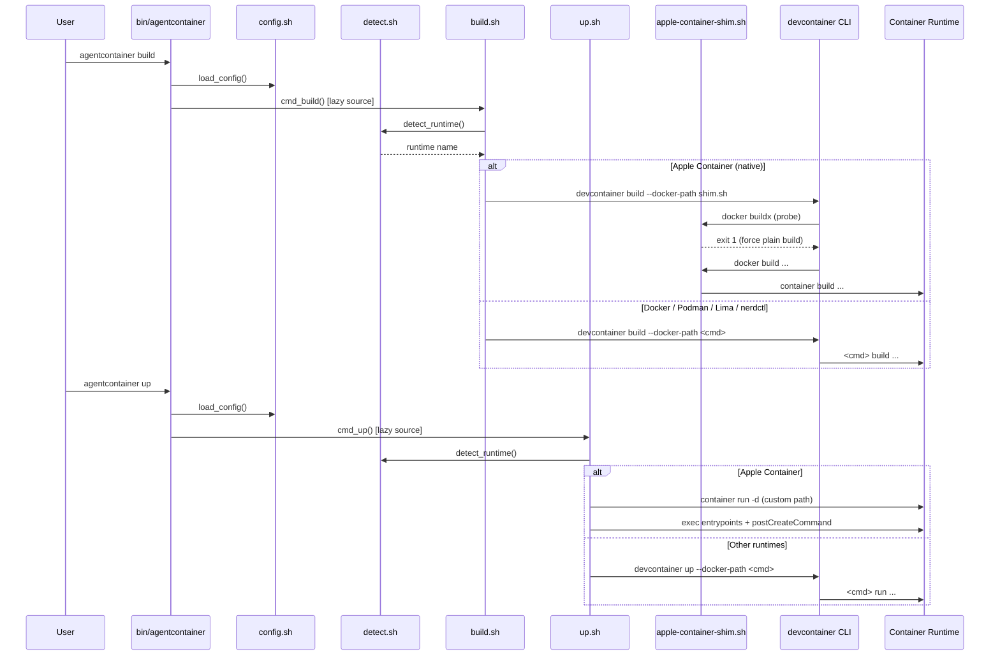

## Context

Pure Bash CLI, v0.1.0. ~2,100 lines across 12 shell scripts in `bin/` and `lib/`. No build step, no compilation — source files are the distribution.

**Dependencies:**
- Bash 3.1+ (macOS ships 3.2; Linux typically 5.x)
- devcontainer CLI (`@devcontainers/cli` via npm)
- envsubst (from gettext)
- jq (JSON parsing in shim and template utilities)
- A container runtime (Docker, Podman, nerdctl, Lima, or Apple Container)

**Tech stack:** Shell scripts only. Configuration is Bash `source`-able key=value files. Templates use envsubst variable expansion. Generated output is JSON (devcontainer.json).

## Objectives

- `OBJ-runtime-abstraction`: A single CLI binary works across 5 operable container runtimes (Docker, Podman, nerdctl, Lima, Apple Container) without user configuration — the system auto-detects the best available runtime per platform. containerd is detected for diagnostic purposes but is not operable (see `DEC-containerd-detection-only`)
- `OBJ-minimal-deps`: Only requires Bash 3.1+, devcontainer CLI, envsubst, jq, and a container runtime — no language runtimes, package managers, or compilation
- `OBJ-lazy-loading`: Command modules are sourced on demand at dispatch time to minimize startup overhead — `lib/utils/` and `lib/platform/detect.sh` are loaded eagerly, command modules and the Apple Container shim are lazy

## Architecture

### System Overview

### Component Interactions

## Components

`CMP-entry-point`: **bin/agentcontainer**
- **Description**: Main CLI entry point — arg parsing, dependency validation, command dispatch
- **Responsibilities**: Resolves symlinks to find `LIB_DIR`, sources `lib/utils/` and `lib/platform/detect.sh` eagerly, validates `devcontainer` and `envsubst` are on PATH, parses global flags (`--help`, `--version`, `--debug`), dispatches to command modules (`init`, `build`, `up`, `shell`, `stop`, `down`, `status`) via lazy `source`. Handles `status` inline by delegating to `print_runtime_info()` from `CMP-platform-detector` and conditionally to `load_config()` / `print_config()` from `CMP-config-loader` (see `CMP-status-command`). Executes agent directly when invoked without a subcommand: sources `shell.sh` for `find_project_container()`, then composes user-provided arguments with the `EXEC_AGENT` template using three-way logic — placeholder substitution (replacing `{}` with shell-quoted arguments via `printf '%q'`), argument appending (when no placeholder exists), or pass-through (when no arguments provided)
- **Dependencies**: `lib/utils/config.sh`, `lib/utils/template.sh`, `lib/platform/detect.sh` (all eager), `lib/commands/shell.sh` (lazy, for agent exec), all other command modules (lazy)

`CMP-config-loader`: **lib/utils/config.sh**
- **Description**: Two-tier cascading configuration loader
- **Responsibilities**: Sources project config (`.agentcontainer/agentcontainer.conf`), then overlays local config (`.agentcontainer/local.conf`). Sets defaults for all 13 variables via `${VAR:=default}`. Exports: `PROJECT_NAME`, `WORKSPACE_FOLDER`, `BASE_IMAGE`, `AGENTS`, `FEATURES`, `SETUP_SCRIPT`, `DEFAULT_SHELL`, `EXEC_AGENT` (project-tier) and `MEMORY_LIMIT`, `CPU_LIMIT`, `PID_LIMIT`, `MACOS_RUNTIME`, `CONTAINER_RUNTIME` (local-tier). Provides `validate_config()`, `print_config()`, and `get_config(key, default)` helpers
- **Dependencies**: None (leaf module)

`CMP-template-engine`: **lib/utils/template.sh**
- **Description**: Template expansion via envsubst with an explicit variable allowlist, plus JSON builder functions for devcontainer.json generation
- **Responsibilities**: `expand_template(src, dst)` substitutes only allowlisted variables (config variables plus computed JSON fragments), preventing accidental shell expansion. `build_features_json()` converts `AGENTS` shorthand names (e.g., `claude-code`) to devcontainer feature URIs. `build_mounts_json()` is an init-context-only helper called exclusively within `generate_devcontainer_json()`, where `CONTAINER_HOME` is inherited from the `REMOTE_USER` derivation — it generates workspace bind, `.claude` bind, and auth named volume mounts. `CMP-up-command` reads mount definitions from the already-generated devcontainer.json and does not call `build_mounts_json()` directly. `build_shell_profiles_json()` reads custom shell definitions from `.agentcontainer/shell-profiles.json`
- **Note**: `build_resource_args()` is defined in template.sh but has no callers in the current codebase — it is not part of the active architecture
- **Dependencies**: `config.sh` (reads exported config variables), derived variables `REMOTE_USER` and `CONTAINER_HOME` (set by `CMP-init-command` during devcontainer.json generation), envsubst, jq

`CMP-platform-detector`: **lib/platform/detect.sh**
- **Description**: Platform identification and container runtime detection with priority-ordered fallback chains
- **Responsibilities**: `detect_platform()` distinguishes darwin/linux/wsl via `uname` and `/proc/version`. `detect_runtime()` checks `CONTAINER_RUNTIME` override first, then `MACOS_RUNTIME` on darwin, then probes runtimes in priority order. `get_container_cmd()` maps runtime names to CLI commands. `get_docker_socket()` returns platform-specific socket paths for devcontainer CLI. `check_runtime()` validates availability via version probe
- **Dependencies**: Container runtime CLIs (probed, not sourced)

`CMP-apple-container-shim`: **lib/platform/apple-container-shim.sh**
- **Description**: Docker-to-Apple-Container CLI translation layer, used as `--docker-path` argument for devcontainer CLI
- **Responsibilities**: Translates `docker build` → `container build` (stripping unsupported flags like `--load`, `--push`, `--cache-to`). Intentionally fails `buildx` probes to force devcontainer CLI fallback to plain `docker build`. Translates `image inspect` output from Apple Container JSON format to Docker-compatible format via jq. Passes through `tag`, `images`, `version` with appropriate mappings. Hardcodes `info` response for BuildKit version detection
- **Dependencies**: `container` CLI (Apple Container), jq

`CMP-init-command`: **lib/commands/init.sh**
- **Description**: Project scaffolding — generates configuration files and devcontainer.json from templates
- **Responsibilities**: Parses `--image`, `--agent`, `--features`, `--setup`, `--shell`, `--exec`, `--resources MEM:CPU:PIDS`, `-f|--force` flags. Creates `.agentcontainer/` and `.devcontainer/` directory structures. Calls `generate_devcontainer_json()` which derives `REMOTE_USER` and `CONTAINER_HOME`, builds JSON fragments, and expands the devcontainer.json template. Generates 5 files: `agentcontainer.conf`, `local.conf`, `devcontainer.json`, `setup.sh` (see `CMP-setup-script` for runtime behavior), and a Claude `SessionStart.sh` hook
- **Dependencies**: `config.sh`, `template.sh`, `CMP-templates` (template source files)

`CMP-build-command`: **lib/commands/build.sh**
- **Description**: Multi-runtime image building with Apple Container native build support and cross-runtime image transfer
- **Responsibilities**: Detects whether Apple Container's native builder daemon is available. If available, delegates to `devcontainer build --docker-path apple-container-shim.sh`. If unavailable, falls back to an alternate Docker-compatible runtime via `find_build_runtime()`, builds there, then attempts image transfer via `transfer_to_apple_container()` (e.g., `docker save | container image load`). Transfer succeeds for docker and lima; nerdctl and podman fail at the transfer step and emit a warning. For non-Apple runtimes, passes the appropriate `--docker-path` to devcontainer CLI
- **Dependencies**: `config.sh`, `detect.sh`, `apple-container-shim.sh`, devcontainer CLI

`CMP-up-command`: **lib/commands/up.sh**
- **Description**: Container startup with an Apple Container custom path that bypasses devcontainer CLI
- **Responsibilities**: Checks if container exists (running → noop, stopped → start). For Apple Container, uses custom `start_apple_container()` which: parses mounts from devcontainer.json, validates memory limits (>=200 MiB for Apple Container 0.10+), runs `container run -d ... sleep infinity`, updates remoteUser UID/GID to match host, executes feature entrypoints from `/usr/local/share/*-entrypoint.sh`, and runs `postCreateCommand`. For other runtimes, delegates to `devcontainer up --docker-path <cmd>`
- **Dependencies**: `config.sh`, `detect.sh`, `build.sh` (for `--rebuild`), devcontainer CLI, container runtime

`CMP-shell-command`: **lib/commands/shell.sh**
- **Description**: Shell profile resolution and container exec with TTY detection
- **Responsibilities**: Resolves shell from `.agentcontainer/shell-profiles.json` custom definitions or falls back to `DEFAULT_SHELL` config. Reads `remoteUser` from devcontainer.json. Finds running container via `find_project_container()`. Builds exec args with `-i`/`-t` based on TTY detection, sets `--user` and `-w` (workspace folder). Supports `--shell PROFILE`, `--exec PATH`, `--root`, and passthrough commands
- **Dependencies**: `config.sh`, `detect.sh`, jq

`CMP-lifecycle-commands`: **lib/commands/stop.sh + lib/commands/down.sh**
- **Description**: Container stop (preserve) and remove (destroy) commands
- **Responsibilities**: `cmd_stop()` finds the running container via `find_project_container()` and issues `$cmd stop`. `cmd_down()` finds any container (running or stopped) via `find_project_container_all()` (which uses `-a` flag) and issues `$cmd rm -f`. Both load config and detect runtime before operating
- **Dependencies**: `config.sh`, `detect.sh`

`CMP-status-command`: **status (inline in bin/agentcontainer)**
- **Description**: Platform, runtime, and project configuration display — implemented inline in the entry point rather than as a separate command module
- **Responsibilities**: Delegates to `print_runtime_info()` from `CMP-platform-detector` to display detected platform and runtime. When a project config exists, delegates to `load_config()` and `print_config()` from `CMP-config-loader` to display project configuration
- **Dependencies**: `CMP-platform-detector` (`print_runtime_info()`), `CMP-config-loader` (`load_config()`, `print_config()`)

`CMP-setup-script`: **lib/templates/setup.sh.tmpl → .devcontainer/setup.sh**
- **Description**: Container-side component generated from `lib/templates/setup.sh.tmpl`, executed as a `postCreateCommand` inside the container
- **Responsibilities**: Fixes auth directory ownership for non-root users via `sudo chown -R` with failure suppression (`|| true`). Skips ownership fix when running as root. Persists auth credential files by moving them into the named volume directory and creating symlinks. Treats all operations as non-fatal per `DEC-non-fatal-post-creation`
- **Dependencies**: Named volume mounted at container `~/.claude`

`CMP-templates`: **lib/templates/**
- **Description**: Template source files consumed by `CMP-init-command` during project scaffolding
- **Contents**: `devcontainer.json.tmpl` (devcontainer configuration), `agentcontainer.conf.tmpl` (project config), `local.conf.tmpl` (local overrides), `setup.sh.tmpl` (post-creation setup script), `SessionStart.sh.tmpl` (Claude Code hook)
- **Dependencies**: None (consumed by `CMP-init-command` via `CMP-template-engine`)

## Interfaces

`INT-runtime-detection`: **detect_runtime**
- **Signature**: `detect_runtime([platform]) → runtime-name`
- **Behavior**: Returns a string identifying the container runtime. Checks `CONTAINER_RUNTIME` override first, then `MACOS_RUNTIME` on darwin. Falls through a priority-ordered probe chain per platform: macOS (container → lima → docker), Linux/WSL (nerdctl → podman → ctr → docker). Returns `"none"` if no runtime found
- **Error behavior**: Returns the string `"none"` when no runtime is detected — this is a sentinel value, not an error exit. Callers must handle `"none"` explicitly (e.g., display a diagnostic or abort with a user-facing message)

`INT-container-cmd`: **get_container_cmd**
- **Signature**: `get_container_cmd(runtime) → cli-command`
- **Behavior**: Maps runtime names to executable commands: `apple-container` → `"container"`, `lima` → `"lima nerdctl"`, `nerdctl` → `"nerdctl"`, `podman` → `"podman"`, `containerd` → `"ctr"`, `docker` → `"docker"`. Returns empty string for unknown runtimes
- **Error behavior**: Returns an empty string for unknown runtime names. Callers must check for empty output before using the command string

`INT-config-loading`: **load_config**
- **Signature**: `load_config([file]) → exports 13 variables`
- **Behavior**: Sources the project config file (default: `.agentcontainer/agentcontainer.conf`), then overlays `.agentcontainer/local.conf` if it exists. Sets defaults for all 13 variables and exports them. Local config values override project config values (last-source-wins)
- **Error behavior**: Skips missing config files silently — if neither file exists, all variables receive their defaults. No content validation is performed on sourced files

`INT-template-expansion`: **expand_template**
- **Signature**: `expand_template(template_file, output_file) → file`
- **Behavior**: Reads template file, applies envsubst with an explicit variable allowlist (config variables plus computed JSON fragments), writes result to output file. Creates output directory if needed. Only allowlisted variables are expanded — all other `$VAR` references pass through unexpanded
- **Error behavior**: Returns exit code 1 with a stderr message when the template file does not exist

`INT-container-finding`: **find_project_container / find_project_container_all**
- **Signature**: `find_project_container(project, cmd) → container-id`; `find_project_container_all(project, cmd) → container-id`
- **Behavior**: Two-pass search. Pass 1: pattern-matches container names against `vsc-${project}-`, `${project}_devcontainer`, `agentcontainer-${project}` using `$cmd ps --format`. Pass 2 (fallback): queries by `devcontainer.local_folder` label. Returns the first matching container ID. `find_project_container_all` uses the same two-pass logic but searches containers in any state via the `-a` flag
- **Error behavior**: Exits with code 1 when no container matches. Callers requiring graceful no-match handling (such as `stop` and `down`) SHALL suppress the error exit via `|| true` and check for empty output before proceeding
- **Consumers**: Entry point (agent exec), `shell.sh`, `stop.sh` (base variant), `down.sh` (`find_project_container_all` variant)
- **Primary definitions**: `find_project_container` in `shell.sh`; `find_project_container_all` in `down.sh`. `stop.sh` carries a duplicate `find_project_container` guarded by `declare -f` to allow standalone sourcing (see `DEC-command-local-container-finding`)

`INT-build-runtime`: **find_build_runtime**
- **Signature**: `find_build_runtime(platform) → runtime-name`
- **Behavior**: Selects a fallback Docker-compatible runtime for image building when the Apple Container native builder is unavailable. Priority chain: lima → docker → nerdctl → podman. Returns empty string if no Docker-compatible build runtime is found
- **Error behavior**: Returns empty string when no suitable runtime is found — callers must check for empty output
- **Note**: This priority chain is intentionally independent of `detect_runtime()` because build fallback requires Docker-compatible image building capability, not general container runtime suitability
- **Transfer limitation**: Only lima and docker support successful image transfer to Apple Container via `docker save | container image load`. nerdctl and podman are probed by this chain and can build images, but fail at the subsequent `transfer_to_apple_container()` step with a warning — the built image is not available in the Apple Container registry
- **Consumer**: `CMP-build-command`

## Decisions

1. `DEC-devcontainer-foundation` `[initial-docs]`: In the context of container orchestration for AI agents, facing the choice between building custom container lifecycle management or delegating to devcontainer CLI, we decided to use devcontainer CLI as the foundation, accepting dependency on its JSON schema and feature ecosystem, to leverage its existing runtime abstraction, feature installation, and IDE integration rather than reimplementing them.

2. `DEC-apple-container-custom-path` `[initial-docs]`: In the context of Apple Container support, facing the choice between forcing all operations through devcontainer CLI or implementing a custom startup path, we decided to use a custom `start_apple_container()` for `up` (while still using devcontainer CLI for `build` via a shim), accepting code duplication of mount parsing and entrypoint execution, because devcontainer CLI doesn't fully expose Apple Container's mount and resource APIs.

3. `DEC-two-tier-config` `[initial-docs]`: In the context of project configuration, facing the choice between a single config file or separating shared and machine-specific settings, we decided on two-tier cascading config (project `.agentcontainer/agentcontainer.conf` committed, local `.agentcontainer/local.conf` gitignored), accepting the complexity of override semantics, to let teams share project config while developers customize resource limits and runtime preferences per machine.

4. `DEC-envsubst-allowlist` `[initial-docs]`: In the context of template expansion, facing the choice between a custom template engine or using standard envsubst, we decided to use envsubst with an explicit variable allowlist, accepting the constraint of a fixed variable set, to prevent accidental expansion of shell environment variables (`$HOME`, `$USER`, etc.) while avoiding a custom parser.

5. `DEC-lazy-command-loading` `[initial-docs]`: In the context of CLI startup performance, facing the choice between sourcing all modules at startup or loading on demand, we decided to source `lib/utils/` and `lib/platform/detect.sh` eagerly and lazy-load command modules (including the Apple Container shim) at dispatch time, accepting slightly more complex dispatch logic, to minimize startup overhead when the user only needs one command.

6. `DEC-buildx-failure-shim` `[initial-docs]`: In the context of the Apple Container shim, facing the choice between implementing full BuildKit/buildx support or forcing a fallback, we decided to intentionally fail the buildx probe so devcontainer CLI falls back to plain `docker build`, accepting that advanced BuildKit cache features are unavailable, because Apple Container's builder is already BuildKit-compatible for standard builds.

7. `DEC-named-volumes-auth` `[initial-docs]`: In the context of AI agent authentication persistence, facing the choice between bind mounts or named volumes for storing credentials, we decided to use named volumes (`${PROJECT_NAME}-claude-home`) mounted at the container's `~/.claude`, accepting that credentials are opaque to the host filesystem, to persist auth tokens across container rebuild cycles without leaking credentials into the project directory.

8. `DEC-non-fatal-post-creation` `[initial-docs]`: In the context of container startup, facing the choice between failing fast on post-creation errors or continuing with a running container, we decided to treat UID/GID sync, feature entrypoint execution, and postCreateCommand failures as non-fatal, accepting reduced failure visibility in a headless CLI, to match devcontainer CLI's behavioral semantics where the container always starts and the user can inspect failures after the fact.

9. `DEC-command-local-container-finding` `[initial-docs]`: In the context of container discovery functions needed by shell, stop, down, and agent-exec paths, facing the constraint that lazy-loaded command modules must be independently sourceable, we decided to duplicate `find_project_container` with a `declare -f` guard in `stop.sh` and define `find_project_container_all` locally in `down.sh`, and neglected extraction to a shared `lib/utils/` module, to achieve full command-module independence, accepting code duplication and the maintenance burden of keeping duplicated logic in sync.

10. `DEC-jq-json-parsing` `[initial-docs]`: In the context of structured JSON parsing across five components (Apple Container shim, template engine, shell command, init command, up command), facing the need for reliable JSON construction and extraction in a pure-Bash CLI, we decided to use jq as a required external dependency, and neglected pure-Bash pattern matching or Python's built-in json module, to achieve correct structured JSON handling without introducing a language runtime dependency, accepting an additional binary dependency that must be present on the host.

11. `DEC-containerd-detection-only` `[initial-docs]`: In the context of runtime detection, facing the fact that the `ctr` CLI uses fundamentally different syntax than Docker-compatible runtimes, we decided to detect containerd for diagnostic purposes only (reported in `status` output) without implementing operable command dispatch, and neglected building full containerd command translation, to achieve accurate platform diagnostics, accepting that containerd users cannot use agentcontainer without a Docker-compatible runtime also available.

## Risks

- **Shell script complexity approaching Bash maintainability limits** → The codebase is ~2,100 lines across 12 scripts with complex JSON generation, multi-runtime branching, and platform-specific paths. Mitigation: strict ShellCheck linting, lazy loading to isolate modules, and the devcontainer CLI handling the hardest orchestration.

- **Apple Container shim tightly coupled to devcontainer CLI fallback behavior** → The shim relies on devcontainer CLI probing `buildx` first and falling back to plain `docker build`. If devcontainer CLI changes its probe order or removes the fallback, the shim breaks silently. Mitigation: CI tests exercise the full Apple Container build path on macOS.

- **Container finding uses pattern matching that is fragile if naming conventions change** → `find_project_container()` matches against `vsc-${project}-`, `${project}_devcontainer`, and `agentcontainer-${project}` patterns, plus a label-based fallback. If devcontainer CLI changes its naming convention, the primary patterns break. Mitigation: label-based fallback (`devcontainer.local_folder`) provides a more stable secondary path.
